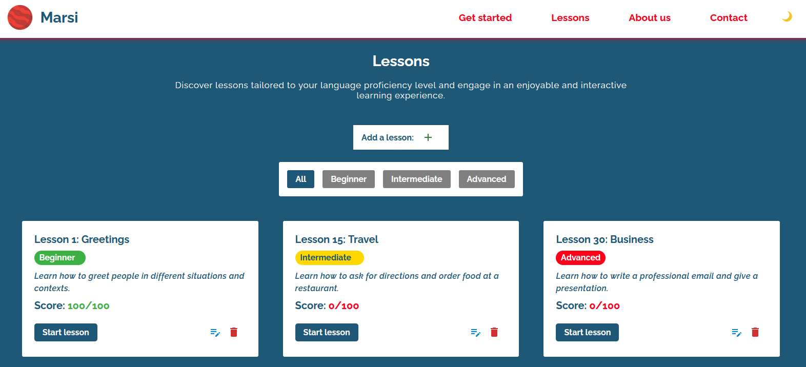
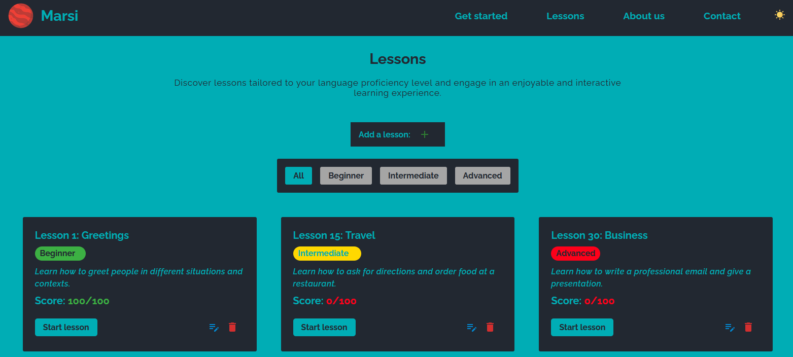
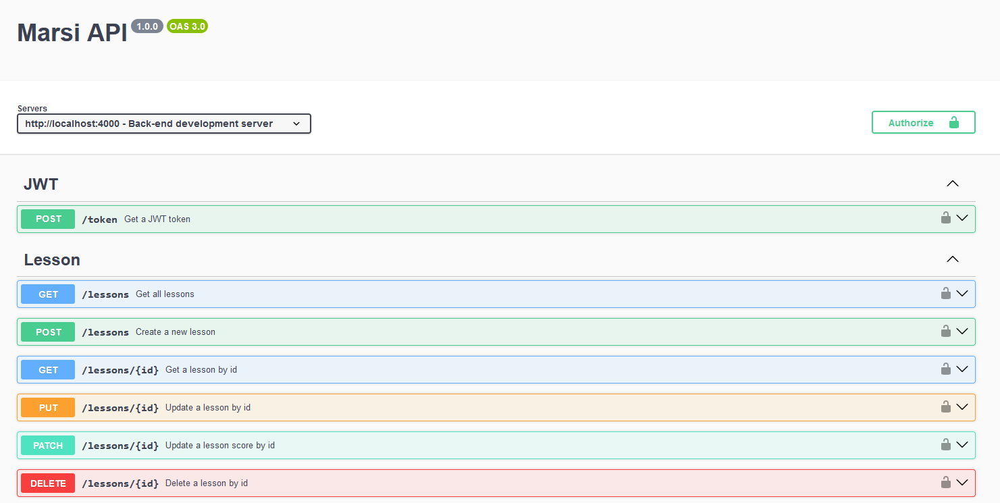

# [Marsi](https://sufferal.github.io/marsi/) 
A simple and robust language learning app that lets you lets add, edit and delete lessons and quizzes. It also features a light and dark mode. 

On the backend, it uses Express and Sqlite3 to store the data and Swagger for API documentation and there are 3 types of users: admin, writer and visitor. Admins can add, edit and delete lessons, writers can add and edit lessons and visitors can only view the lessons.

## Live demo
This doesn't include the backend, but you can still see the frontend in action at: 

[https://sufferal.github.io/marsi/](https://sufferal.github.io/marsi/) 


## Features
- Add, edit and delete lessons
- Take quizzes
- Filter lessons by difficulty
- Toggle light and dark mode 
- API documentation with Swagger
- 3 types of users: admin, writer and visitor

## Libraries
### Frontend
- [React](https://react.dev/)
- [Material-UI](https://mui.com/material-ui/) 

### Backend
- [Express](https://expressjs.com/)
- [Sqlite3](https://www.sqlite.org/index.html)
- [Swagger](https://swagger.io/)

## Installation
1. Clone the repository
```
git clone git@github.com:Sufferal/marsi.git
```
2. Install dependencies
```
npm install
```
### Frontend
- Start the development server for the frontend
```
npm start
```
- Open the app in your browser at [http://localhost:3000](http://localhost:3000)
### Backend
- Start the development server for the backend 
```
node server.js
```
- Open the API documentation in your browser at [http://localhost:4000/swagger](http://localhost:4000/swagger)

## Screenshots
### Light mode


### Dark mode


### Swagger


## Credits
All images used are only for demonstration purposes of the app.

All icons are from [flaticon](https://www.flaticon.com/) and [Material-UI](https://mui.com/material-ui/).
